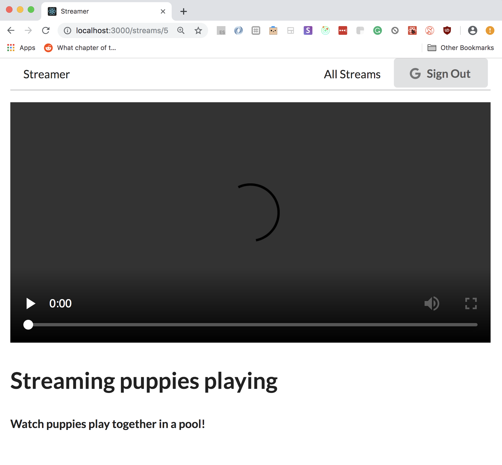
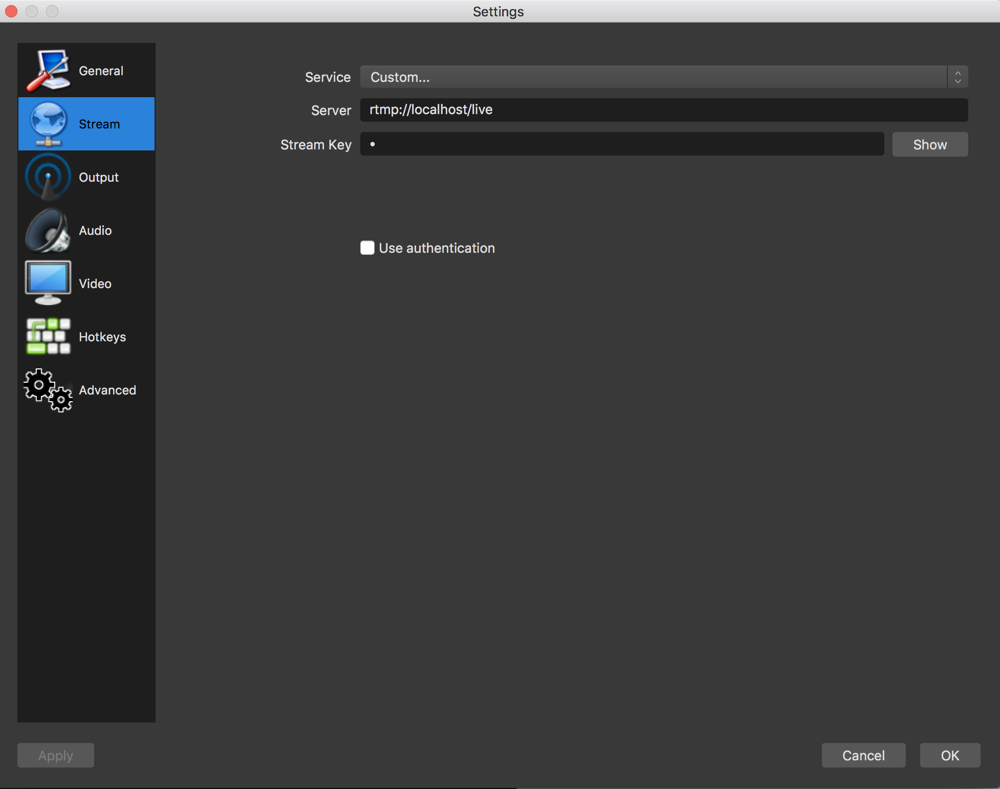

# Streamer

Streamer is a streaming web app where users can join and create live broadcasts using the [OBS](https://obsproject.com/) software.

## Usage

Before you begin cloning make sure your computer has [git](https://git-scm.com/book/en/v2/Getting-Started-Installing-Git), [Node](https://docs.npmjs.com/downloading-and-installing-node-js-and-npm#using-a-node-version-manager-to-install-nodejs-and-npm), and [OBS](https://obsproject.com/) installed.

To clone the repo locally onto your computer, open the terminal then type in:

```bash
$ git clone https://github.com/helenyau0/Streamer.git
# downloads the project
$ cd streamer
# navigates into project folder
```

Now that you've cloned the repo locally, you will need to start up all 3 servers. You will need to have 3 terminal windows opened for each server.

Inside streamer directory navigate to client:

```bash
$ cd client
# changes directory to client folder
$ npm install
# installs all the package dependencies for client
$ npm start
# starts up client server on localhost:3000
```

Now open another terminal window and change into streamer directory. From here navigate to api directory:

```bash
$ cd api
# changes directory to api folder
$ npm install
# installs all the package dependencies
$ npm start
# starts up backend server
```

Now in the third terminal window, again from the streamer directory, navigate into the rtmpserver directory:

```bash
$ cd rtmpserver
# changes directory to rtmpserver folder
$ npm install
# installs all the package dependencies
$ npm start
# starts up server for streaming
```

Congratulations! Streamer is now up and running! To start using, navigate to http://localhost:3000/ and login using Google Oauth.

Once you've logged in you are now authorized to create live streams.

After creating a stream, navigate to your newly created stream:



Next open up OBS and configure your stream settings to have the following:

- Service: custom
- Server: rtmp://localhost/live
- Stream key: is the id of your newly created stream in the url (in our case the id = 5)



Next click Ok, and now you're ready to start streaming!
